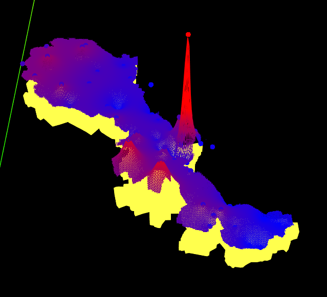
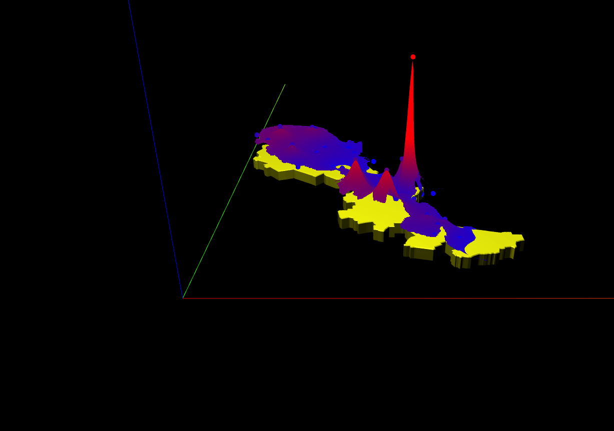

# griddata_webgl
grid data. 三维点曲面近似.  



* npm install  
#### export  zrender源码中的 node_modules/_zrender@4.0.4@zrender/src/tool/path.js 的 createPathProxyFromString 函数  
``` javascript  
export function createPathProxyFromString(data) {
```  
* npm run dev
